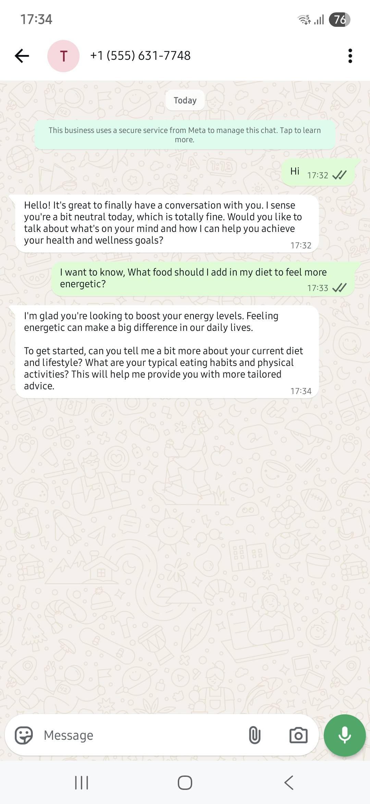

# 🤖 BotMaze – AI WhatsApp Assistant Platform

BotMaze is an AI-powered WhatsApp automation platform where multiple chat agents can be created, customized, and assigned to clients dynamically.  
It allows admins to manage agents, clients, and conversations seamlessly from an intuitive dashboard built using **FastAPI**, **Jinja2**, and **TailwindCSS**.

---

## 🚀 Features

### 🌐 WhatsApp Integration
- Real-time WhatsApp messaging through **Meta WhatsApp Cloud API**  
- Supports **permanent access tokens**  
- Auto-greeting for new clients  
- Dynamic client-agent conversation routing  

### 🧩 Agent Management
- Create, edit, delete, activate, and deactivate agents  
- Define unique personality, tone, and behavior for each agent  
- Agents respond intelligently using integrated AI models  

### 🗣️ Client Management
- Automatic client creation on first WhatsApp message  
- Assign or reassign any agent to any client  
- Real-time client list with last message, phone number, and current agent  

### 📊 Admin Dashboard
- Clean dashboard interface built with TailwindCSS  
- Manage agents and clients easily  
- Displays total active agents, connected WhatsApp details, and account summary  

---

## 🖼️ Screenshots

### 🏠 Dashboard  


### 👥 Clients Page  


### 🤖 Agents Page  


### 💬 WhatsApp Chat – StudyBot  


### 💬 WhatsApp Chat – Health Coach  



---

## ⚙️ Tech Stack

| Layer | Technology |
|-------|-------------|
| Backend | FastAPI |
| Database | SQLite (SQLAlchemy ORM) |
| Frontend | Jinja2 + TailwindCSS |
| Messaging | Meta WhatsApp Cloud API |
| AI Layer | Custom NLP + Prompt-based response logic |
| Authentication | Basic user management (Admin login) |

---


## 🔐 Environment Variables (.env)
Create a `.env` file in the root directory with the following:

```bash
WHATSAPP_VERIFY_TOKEN=your_meta_verify_token
WHATSAPP_PHONE_NUMBER_ID=your_meta_phone_number_id
WHATSAPP_ACCESS_TOKEN=your_permanent_access_token
DATABASE_URL=sqlite:///./botmaze.db


